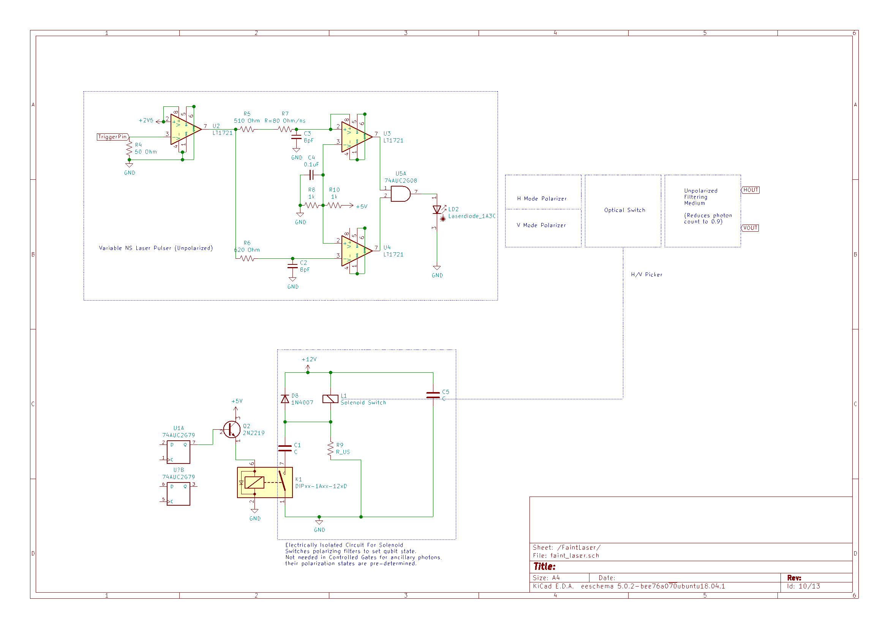

# QCore

## Theory of Operation

The 8Q QCore in an 8 qubit general purpose processor which uses polarization encoded photons to perform computation.

### Qubit Description

Each qubit in the system has two modes H and V which correspond to the binary values 0 and 1 as shown in the table below

| H    | 0    |
| ---- | ---- |
| V    | 1    |

These modes are physical paths which the photon (our qubit) travels as shown in the circuit diagram below.

#### Qubit Modes

### Single Photon Sources

In order for us to achieve true quantum computation, we require a single photon source (SPS), unfortunately at the time of this writing there are no affordable commercially available SPS on the market that we can make use of. To get around this issue, we utilize a technology known as a faint laser. The way this works is we pulse a laser extremely fast to generate a laser beam with a very small number of photons and pass it through a filtering medium to reduce the number of photons. This is a probabilistic operation, and so does not guarantee a single photon on every operation, however with proper materials selection, single photon generation can be made arbitrarily close to 1. 

**NOTE:** Because of this workaround, our SPS is not [anti-bunched](https://en.wikipedia.org/wiki/Photon_antibunching) making this iteration of the processor unsuitable for cryptographic purposes.

The circuit diagram for a faint laser SPS is provided below. Each qubit will have its' own SPS and the Controlled Logic Gates will have their own SPS as well.

The SPS consists of a sub-nanosecond laser driver which takes an input called "TriggerPin", when this input is set to HIGH it causes a very fast pulse of light to be generated by the laser diode. The photons then travel to a polarizing beam splitter where approximately 50% of the photons are passed to each mode. To set the state of the qubit, an input is passed to a digital FlipFlop gate which powers a relay and an isolate solenoid which blocks the path of one or the other mode to create a vacuum state in one mode and allow photons in the other mode. Both modes then pass through an unpolarized filtering medium to reduce the photon count to less than one.

#### Faint Laser SPS

### Quantum Logic Gates

#### Measure

The measurement gate counts the number of photons in each mode for each qubit, to do this a silicon photomultiplier is used in the H and V modes.

#### Unitary Gates

##### Pauli-X Gate

##### Pauli-Y Gate

##### Pauli-Z Gate

##### Hadamard Gate

#### Controlled Gates

Controlled gates are special cases for the quantum processor, 

##### CX Gate

The Controlled-X Gate (shorthand: CX) performs a controlled NOT operation on two qubits. 

